# AgentFlow — Codebase Flow

Mermaid diagrams mapping the runtime flow of AgentFlow ("The CRM for agents who hate CRMs"). Rendered in any markdown preview that supports Mermaid (VSCode "Markdown Preview Mermaid Support", GitHub, Obsidian, etc.).

> Last regenerated: 2026-06-07. Source paths reference `src/` at the repo root.

---

## 1. High-Level System Topology

External actors, the Next.js app, and the services it talks to.

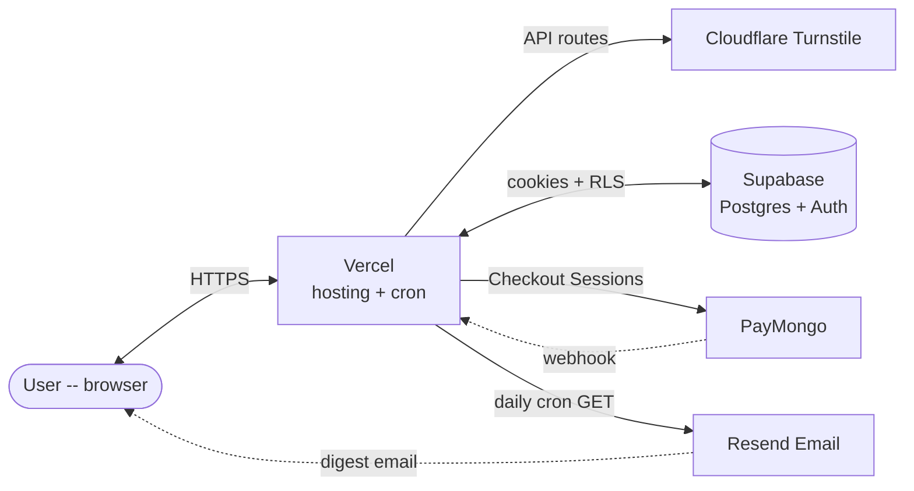

---

## 2. Auth — Middleware Gate (every request)

`src/lib/supabase/middleware.ts:4` runs on every request. The decision tree below is the single source of truth for who sees what.

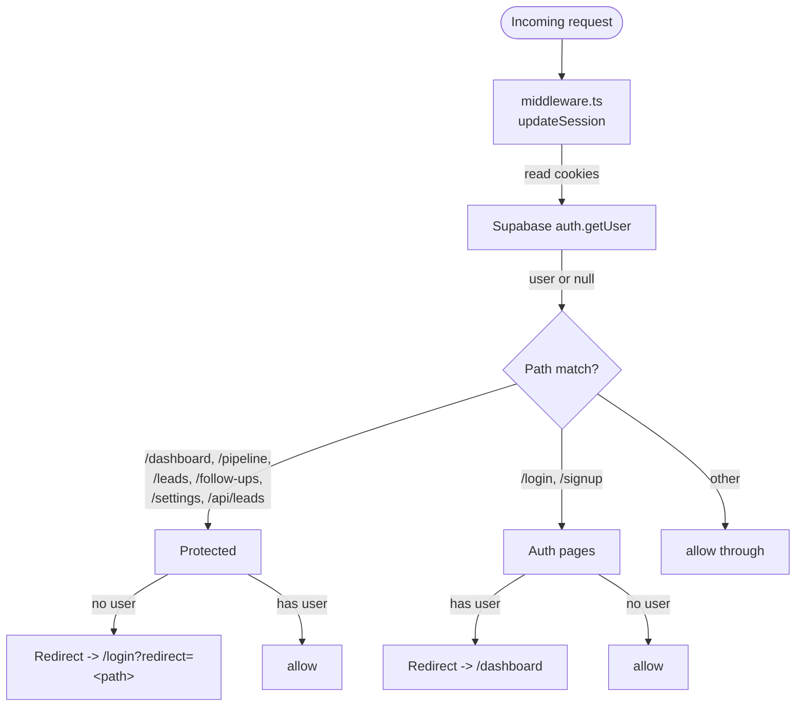

**Protected prefix list** — `src/lib/supabase/middleware.ts:41`.

---

## 3. Auth — Magic Link / Password Sign-in

User submits the login form → Supabase Auth issues a magic link or verifies a password. The link points back at `/auth/callback` (route handler) which exchanges the `code` for a session cookie.

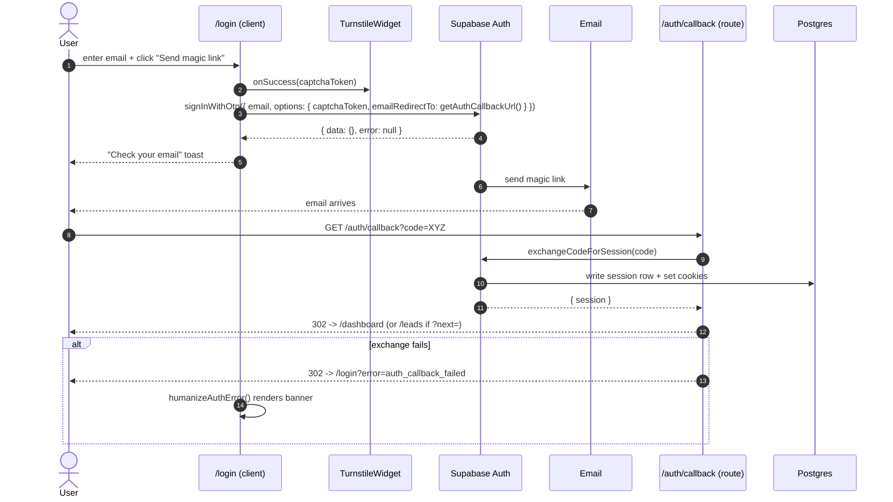

Key files:
- `src/app/(auth)/login/page.tsx` — form, captcha wiring, error rendering
- `src/lib/auth.ts:20` — `getOAuthRedirectTo()` builds the callback URL from `window.location.origin`
- `src/app/auth/callback/route.ts:30` — `exchangeCodeForSession`

---

## 4. Auth — Google OAuth

Identical destination as magic link, different entry point. Supabase handles the provider handshake.

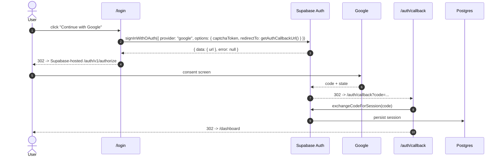

---

## 5. Leads — 3-Layer Plan-Limit Enforcement

A new lead hits three independent gates before it can be inserted. All three read from `PLAN_LIMITS` (`src/lib/constants.ts`).

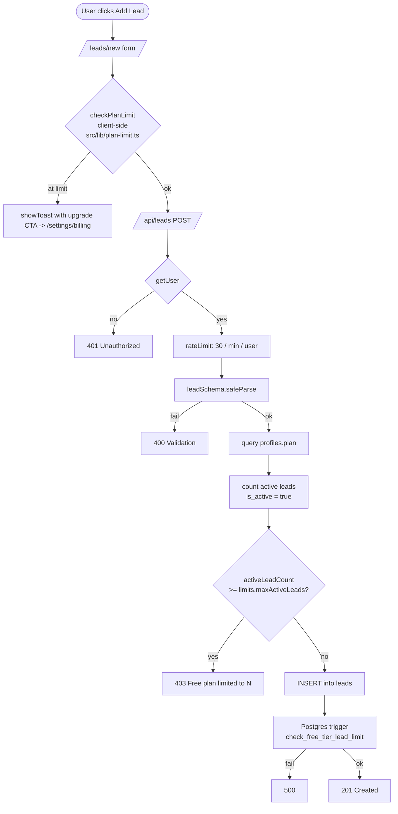

The DB trigger (`supabase/migrations/002_update_free_tier_limit_to_10.sql`) is the **last line of defense** — it cannot be bypassed by a client bug.

---

## 6. Pipeline — Drag-and-Drop Stage Move

`/pipeline` is a client component that fetches all leads, groups them by `pipeline_stage`, and uses `@hello-pangea/dnd` (lazy-loaded via `next/dynamic`, `ssr: false`) for the drag interaction. The drop triggers an optimistic update plus a server PATCH.

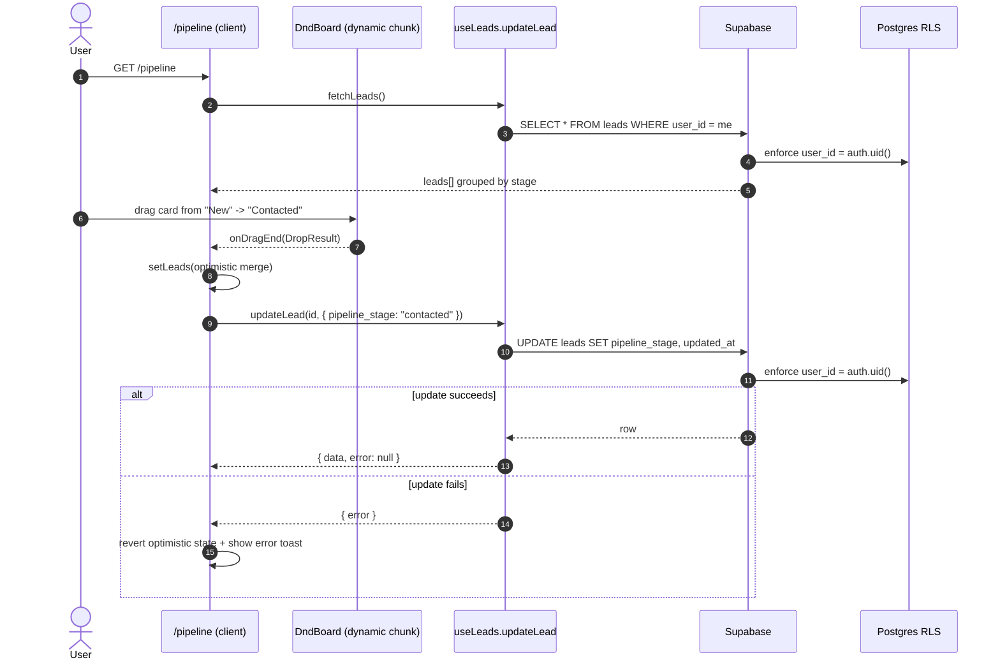

**Performance note:** `@hello-pangea/dnd` (191KB) is dynamically imported so it only ships when the user actually visits `/pipeline` — it does not appear in the auth/dashboard/landing chunks.

---

## 7. PayMongo — Checkout + Webhook (Pro upgrade)

The flow splits into a synchronous user-facing leg (create-checkout → PayMongo-hosted page) and an async server leg (webhook → DB update). The webhook is the source of truth — never trust the redirect.

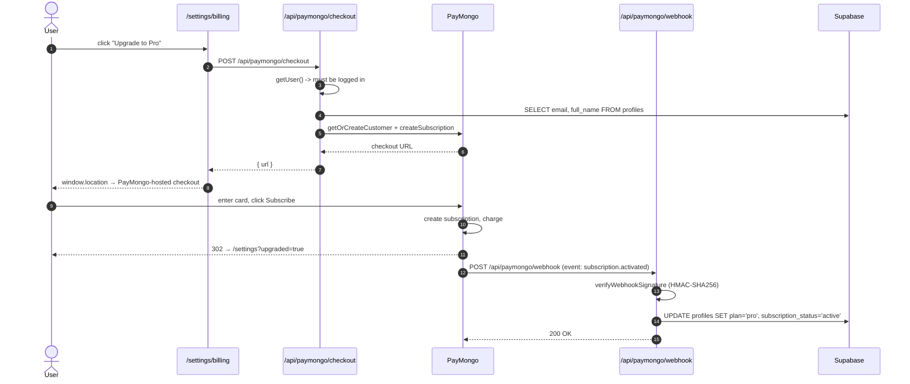

**Webhook handlers** (`src/lib/paymongo.ts`):
- `subscription.activated` → `handleSubscriptionActivated` → set plan to `pro`
- `subscription.cancelled` → `handleSubscriptionCancelled` → set plan to `free`
- `invoice.payment_failed` → `handlePaymentFailed` → set `subscription_status='past_due'`
- `invoice.paid` → `handlePaymentPaid` → restore active status

**Idempotency:** PayMongo retries webhooks on 5xx. The DB update is a single row-level UPDATE keyed on `id` (the user) — safe to re-apply. Deduplication uses the `webhook_events` table with `paymongo_event_id` unique constraint.

---

## 8. Daily Digest — Cron + Email

A Vercel Cron hits `/api/cron/daily-digest` once a day. The handler queries all leads with a `next_action_date` ≤ today, groups them by user, and emails each user a digest via Resend.

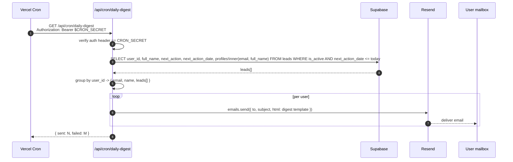

**Auth:** `CRON_SECRET` is set in Vercel env. Anyone without the bearer token gets `401`.

---

## 9. Request Lifecycle — Putting It Together

A typical authenticated page load touches five layers. Use this to trace why something is slow or failing.

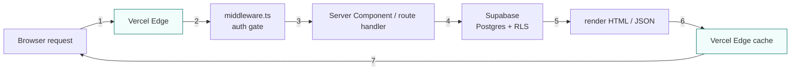

| Step | Latency typical | Failure mode |
|------|----------------|--------------|
| 1 → 2 | 5-30ms (TLS) | Network |
| 2 → 3 | <1ms (match) | Misconfigured protected prefix list |
| 3 → 4 | 50-200ms (DB) | Supabase outage, slow query, RLS denial |
| 4 → 5 | <10ms (Postgres) | DB constraint violation, trigger rejection |
| 5 → 6 | <5ms | None |
| 6 → 7 | 5-50ms (TTFB) | Vercel region miss |

---

## 10. Module Dependency Graph (selected)

Who imports what. Useful for understanding blast radius when changing a file.

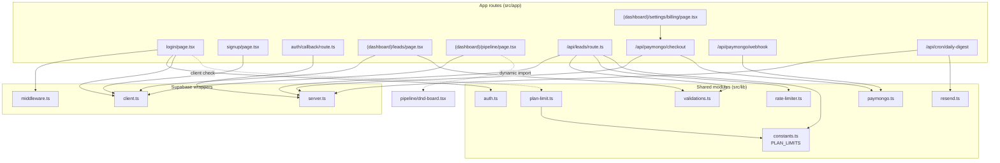

---

## 11. Database Schema (RLS-enforced)

Three tables, all gated by `auth.uid() = user_id` (or `auth.uid() = id` for `profiles`).

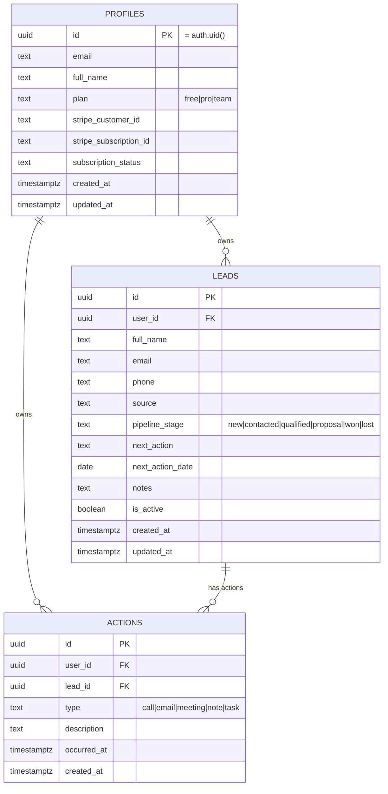

---

## How to Update

These diagrams map the runtime truth. When you change a flow, edit the corresponding `sequenceDiagram` / `flowchart`. Keep file-path references in the form `src/path:line` so reviewers can jump to the source.
